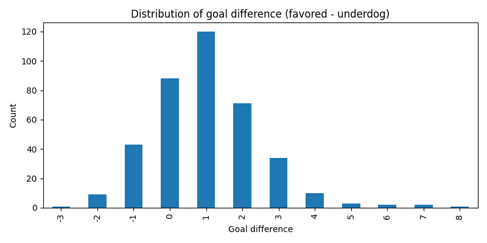
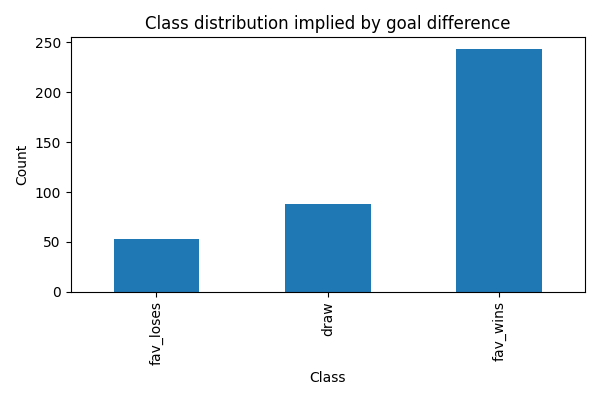

# 1. Detect score columns in matches
Searching for score columns in matches...
Detected home score column: home_team_score
Detected away score column: away_team_score
# 2. Merge raw match scores into `fav_df`
After merging score columns:
df_reg shape: (384, 188)
Missing values in detected score columns:
home_team_score    0
away_team_score    0
dtype: int64
# 3. Build favored / underdog goals
# 4. Sanity-check against Mingjie's `y3` labels
Agreement between reconstructed y3 and Mingjie's y3: 0.9453

Mismatches found:
      match_id  year fav_side  y3  y3_from_goal_diff  fav_goals  und_goals
51   M-2002-52  2002     home   2                  1          1          1
58   M-2002-59  2002     home   0                  1          0          0
117  M-2006-54  2006     home   0                  1          0          0
120  M-2006-57  2006     away   0                  1          1          1
122  M-2006-59  2006     home   0                  1          0          0
127  M-2006-64  2006     away   0                  1          1          1
182  M-2010-55  2010     away   0                  1          0          0
185  M-2010-58  2010     home   2                  1          1          1
240  M-2014-49  2014     home   2                  1          1          1
243  M-2014-52  2014     home   2                  1          1          1
251  M-2014-60  2014     home   2                  1          0          0
253  M-2014-62  2014     away   2                  1          0          0
306  M-2018-51  2018     home   0                  1          1          1
307  M-2018-52  2018     home   2                  1          1          1
311  M-2018-56  2018     home   0                  1          1          1
315  M-2018-60  2018     away   2                  1          2          2
372  M-2022-53  2022     away   2                  1          1          1
374  M-2022-55  2022     away   0                  1          0          0
376  M-2022-57  2022     away   0                  1          1          1
377  M-2022-58  2022     away   2                  1          2          2
# 5. Build human-readable class from `goal_diff`
Goal difference summary:
count    384.000000
mean       1.013021
std        1.509703
min       -3.000000
25%        0.000000
50%        1.000000
75%        2.000000
max        8.000000
Name: goal_diff, dtype: float64

Goal difference value counts:
goal_diff
-3      1
-2      9
-1     43
 0     88
 1    120
 2     71
 3     34
 4     10
 5      3
 6      2
 7      2
 8      1
Name: count, dtype: int64

True class distribution from goal_diff:
true_class
draw          88
fav_loses     53
fav_wins     243
Name: count, dtype: int64
# 6. Build regression feature matrix
Regression design matrices:
X shape: (384, 97)
y shape: (384,)
# 7. Temporal split
Temporal split summary:
Train years: [np.int64(2002), np.int64(2006), np.int64(2010), np.int64(2014)]
Holdout years: [np.int64(2018), np.int64(2022)]
Train size: 256
Holdout size: 128

Train goal_diff distribution:
goal_diff
-3     1
-2     7
-1    25
 0    60
 1    83
 2    45
 3    22
 4     9
 6     2
 7     1
 8     1
Name: count, dtype: int64

Holdout goal_diff distribution:
goal_diff
-2     2
-1    18
 0    28
 1    37
 2    26
 3    12
 4     1
 5     3
 7     1
Name: count, dtype: int64

Train class distribution:
true_class
draw          60
fav_loses     33
fav_wins     163
Name: count, dtype: int64

Holdout class distribution:
true_class
draw         28
fav_loses    20
fav_wins     80
Name: count, dtype: int64
# 8. Missingness check
Top 20 features by missing rate in X_train:
und_hist_pso_win_rate_shrunk                0.714844
feat_away_mgr_hist_win_rate_shrunk          0.703125
feat_home_mgr_hist_win_rate_shrunk          0.699219
fav_hist_pso_win_rate_shrunk                0.359375
fav_rest_days_since_prev_match              0.250000
und_rest_days_since_prev_match              0.250000
feat_rest_days_diff                         0.250000
feat_away_hist_win_rate_vs_home_conf        0.195312
feat_hist_goal_diff_per_match_diff          0.167969
und_squad_squad_jaccard_vs_prev_wc          0.140625
und_hist_goal_diff_per_match                0.140625
und_hist_frac_tournaments_reached_ko        0.140625
und_hist_et_rate                            0.140625
und_squad_squad_overlap_count_vs_prev_wc    0.140625
feat_home_hist_win_rate_vs_away_conf        0.109375
fav_hist_goal_diff_per_match                0.031250
fav_hist_frac_tournaments_reached_ko        0.031250
fav_squad_squad_overlap_count_vs_prev_wc    0.031250
fav_squad_squad_jaccard_vs_prev_wc          0.031250
fav_hist_et_rate                            0.031250
dtype: float64

# 9. Plot target distribution

# 10. Save objects for next step

Part 2 completed successfully.
