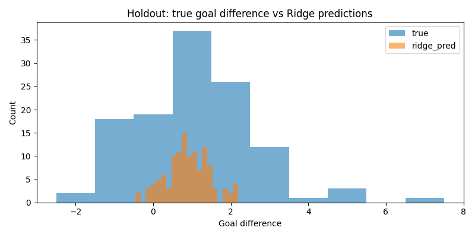
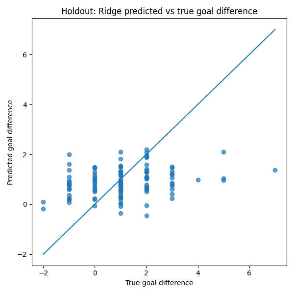

Train shape: (244, 97) (244,)
Holdout shape: (119, 97) (119,)
Training years: [np.int64(2002), np.int64(2006), np.int64(2010), np.int64(2014)]

DummyRegressor LOTO CV results:
   fold val_year       mae      rmse  pred_mean
0     1   [2002]  1.271889  1.702125   1.148352
1     2   [2006]  1.052536  1.444452   0.994565
2     3   [2010]  0.953917  1.419267   1.071429
3     4   [2014]  1.132971  1.583555   1.048913

DummyRegressor mean CV metrics:
mae     1.102828
rmse    1.537350
dtype: float64

DummyRegressor holdout metrics:
{'holdout_mae': 1.127428020388483, 'holdout_rmse': 1.520725763806749, 'holdout_pred_mean': 1.0655737704918034}

Best Ridge alpha:
{'model__alpha': 100.0}
Best Ridge CV MAE: 1.1608286080386938

Ridge LOTO CV results:
   fold val_year       mae      rmse  pred_mean  pred_std
0     1   [2002]  1.196391  1.622967   0.944931  0.478804
1     2   [2006]  1.123812  1.516478   0.850745  0.626943
2     3   [2010]  1.037697  1.468814   1.113786  0.701210
3     4   [2014]  1.285416  1.668017   1.175221  0.672237

Ridge mean CV metrics:
mae     1.160829
rmse    1.569069
dtype: float64

Ridge holdout metrics:
{'holdout_mae': 1.153497220906074, 'holdout_rmse': 1.4837031818155397, 'pred_mean': 0.8978357146947472, 'pred_std': 0.5476522490501561, 'true_mean': 1.084033613445378, 'true_std': 1.52061371916202}

Holdout prediction preview:
    year  y_true  y_pred_dummy  y_pred_ridge
0   2018       5      1.065574      1.045316
1   2018       1      1.065574      0.748190
2   2018       1      1.065574      0.720206
3   2018       0      1.065574      0.503243
4   2018       1      1.065574      2.101610
5   2018       0      1.065574      0.944551
6   2018       1      1.065574      0.538731
7   2018       2      1.065574      0.784224
8   2018       1      1.065574      1.320244
9   2018      -1      1.065574      0.820133
10  2018       0      1.065574      1.190154
11  2018       1      1.065574      0.592502
12  2018       3      1.065574      1.469550
13  2018       1      1.065574      1.183791
14  2018      -1      1.065574      0.889953

Part 3 completed successfully.
