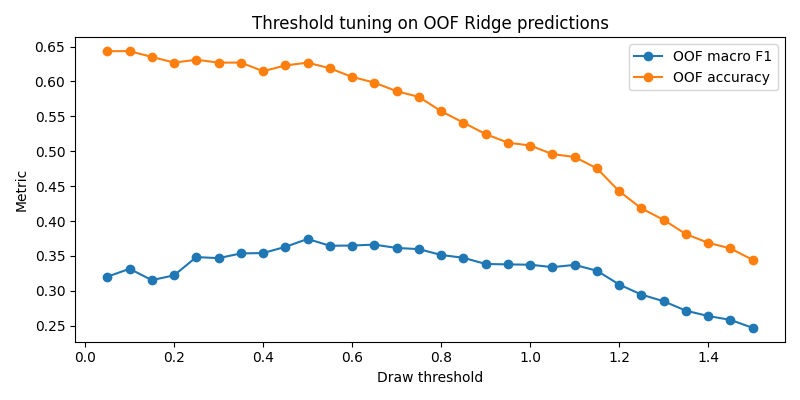
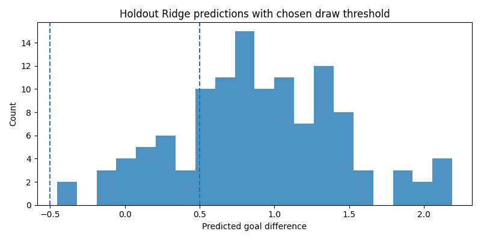

OOF prediction summary:
count    244.000000
mean       1.021305
std        0.639750
min       -0.696381
25%        0.585740
50%        1.026074
75%        1.428045
max        2.777342
dtype: float64

Top 15 threshold candidates by OOF macro F1:
    threshold  accuracy  macro_f1  weighted_f1  pred_draw_rate  
0        0.50  0.627049  0.374276     0.580729        0.192623
1        0.65  0.598361  0.366168     0.568877        0.295082
2        0.60  0.606557  0.364843     0.569831        0.258197
3        0.55  0.618852  0.364543     0.575002        0.225410
4        0.45  0.622951  0.362945     0.572631        0.176230
5        0.70  0.586066  0.361421     0.561033        0.323770
6        0.75  0.577869  0.359712     0.556653        0.344262
7        0.40  0.614754  0.354096     0.561728        0.151639
8        0.35  0.627049  0.353551     0.564757        0.122951
9        0.80  0.557377  0.351323     0.542493        0.377049
10       0.25  0.631148  0.348326     0.563005        0.102459
11       0.85  0.540984  0.347268     0.531475        0.413934
12       0.30  0.627049  0.346781     0.560374        0.110656
13       0.90  0.524590  0.338468     0.519178        0.434426
14       0.95  0.512295  0.337817     0.510336        0.475410

    pred_fav_win_rate  pred_fav_loss_rate
0            0.799180            0.008197
1            0.700820            0.004098
2            0.737705            0.004098
3            0.770492            0.004098
4            0.815574            0.008197
5            0.676230            0.000000
6            0.655738            0.000000
7            0.836066            0.012295
8            0.864754            0.012295
9            0.622951            0.000000
10           0.881148            0.016393
11           0.586066            0.000000
12           0.877049            0.012295
13           0.565574            0.000000
14           0.524590            0.000000

Selected threshold: 0.5

Holdout classification metrics from Ridge + threshold:
{'threshold': np.float64(0.5), 'accuracy': 0.5798319327731093, 'macro_f1': 0.2979401993355482, 'weighted_f1': 0.5293615120466793}

Holdout confusion matrix (rows=true, cols=pred) with label order [0=fav_loss, 1=draw, 2=fav_win]:
[[ 0  7 13]
 [ 0  3 16]
 [ 0 14 66]]

Classification report:
              precision    recall  f1-score   support

   fav_loses     0.0000    0.0000    0.0000        20
        draw     0.1250    0.1579    0.1395        19
    fav_wins     0.6947    0.8250    0.7543        80

    accuracy                         0.5798       119
   macro avg     0.2732    0.3276    0.2979       119
weighted avg     0.4870    0.5798    0.5294       119

Holdout class distribution comparison:
           true_count  pred_count
fav_loses          20           0
draw               19          24
fav_wins           80          95
C:\Users\yiyun\AppData\Roaming\Python\Python314\site-packages\sklearn\metrics\_classification.py:1833: UndefinedMetricWarning: Precision is ill-defined and being set to 0.0 in labels with no predicted samples. Use `zero_division` parameter to control this behavior.
  _warn_prf(average, modifier, f"{metric.capitalize()} is", result.shape[0])
C:\Users\yiyun\AppData\Roaming\Python\Python314\site-packages\sklearn\metrics\_classification.py:1833: UndefinedMetricWarning: Precision is ill-defined and being set to 0.0 in labels with no predicted samples. Use `zero_division` parameter to control this behavior.
  _warn_prf(average, modifier, f"{metric.capitalize()} is", result.shape[0])
C:\Users\yiyun\AppData\Roaming\Python\Python314\site-packages\sklearn\metrics\_classification.py:1833: UndefinedMetricWarning: Precision is ill-defined and being set to 0.0 in labels with no predicted samples. Use `zero_division` parameter to control this behavior.
  _warn_prf(average, modifier, f"{metric.capitalize()} is", result.shape[0])

Part 4 completed successfully.
