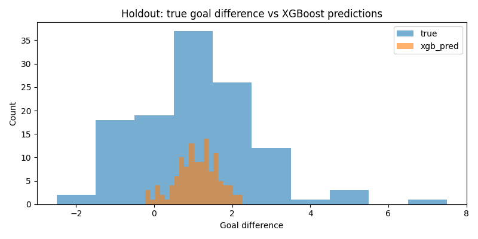
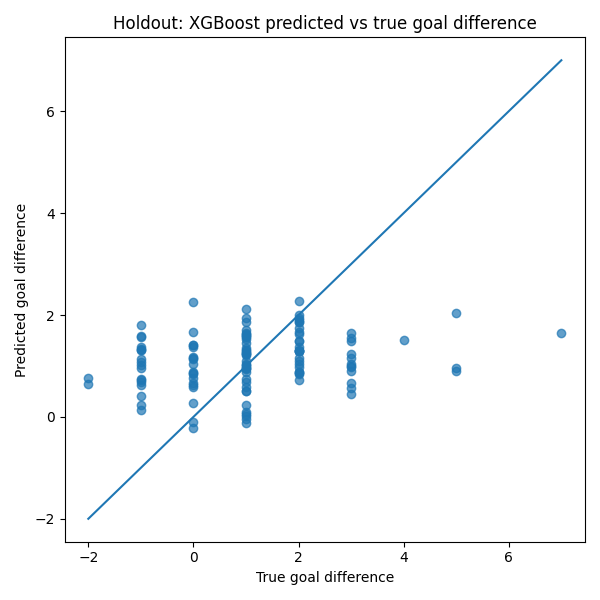

Train shape: (244, 97) (244,)
Holdout shape: (119, 97) (119,)
Training years: [np.int64(2002), np.int64(2006), np.int64(2010), np.int64(2014)]
Fitting 4 folds for each of 128 candidates, totalling 512 fits

Best XGB params:
{'model__colsample_bytree': 0.8, 'model__learning_rate': 0.03, 'model__max_depth': 3, 'model__min_child_weight': 1, 'model__n_estimators': 100, 'model__reg_lambda': 10.0, 'model__subsample': 1.0}
Best XGB CV MAE: 1.0768736004829407

XGBRegressor LOTO CV results:
   fold val_year       mae      rmse  pred_mean  pred_std  pred_min  pred_max
0     1   [2002]  1.108512  1.533466   1.020815  0.454973 -0.174677  2.283273
1     2   [2006]  1.103832  1.451476   0.888100  0.551735 -0.533155  1.853411
2     3   [2010]  1.007312  1.343276   1.141274  0.493679 -0.151721  2.121601
3     4   [2014]  1.087839  1.410302   1.109149  0.581005 -0.075641  3.143651

XGBRegressor mean CV metrics:
mae     1.076874
rmse    1.434630
dtype: float64

XGBRegressor holdout metrics:
{'holdout_mae': 1.145117163658142, 'holdout_rmse': 1.4902898095695878, 'pred_mean': 1.1084517240524292, 'pred_std': 0.5301638841629028, 'pred_min': -0.22640225291252136, 'pred_max': 2.2654929161071777, 'true_mean': 1.084033613445378, 'true_std': 1.52061371916202}

Model comparison:
                   model    cv_mae   cv_rmse  holdout_mae  holdout_rmse
0                  Ridge  1.160829  1.569069     1.153497      1.483703
1  RandomForestRegressor  1.101702  1.501599     1.139748      1.470676
2           XGBRegressor  1.076874  1.434630     1.145117      1.490290

Part 6 completed successfully.
