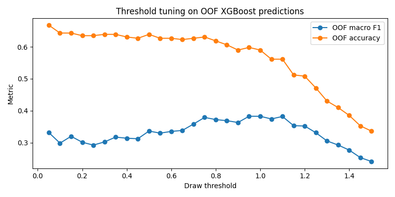
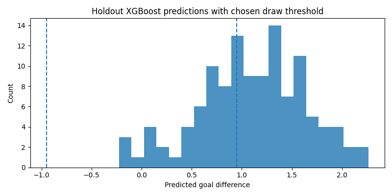

OOF prediction summary:
count    244.000000
mean       1.040510
std        0.532071
min       -0.533155
25%        0.704674
50%        1.059562
75%        1.370160
max        3.143651
dtype: float64

Selected threshold: 0.95

Top 15 threshold candidates by OOF macro F1:
    threshold  accuracy  macro_f1  weighted_f1  pred_draw_rate  
0        0.95  0.598361  0.382673     0.582345        0.389344
1        1.00  0.590164  0.382514     0.578070        0.418033
2        1.10  0.561475  0.381905     0.555304        0.520492
3        0.75  0.631148  0.378934     0.594048        0.270492
4        1.05  0.561475  0.374155     0.555607        0.479508
5        0.80  0.618852  0.372144     0.586046        0.286885
6        0.85  0.606557  0.368694     0.579261        0.311475
7        0.90  0.590164  0.362988     0.569161        0.340164
8        0.70  0.627049  0.358095     0.582998        0.233607
9        1.15  0.512295  0.353105     0.513148        0.577869
10       1.20  0.508197  0.352016     0.511120        0.598361
11       0.65  0.622951  0.338171     0.570833        0.200820
12       0.50  0.639344  0.336171     0.573912        0.151639
13       0.60  0.627049  0.335003     0.571100        0.188525
14       0.05  0.668033  0.331372     0.560144        0.004098

    pred_fav_win_rate  pred_fav_loss_rate
0            0.610656            0.000000
1            0.581967            0.000000
2            0.479508            0.000000
3            0.729508            0.000000
4            0.520492            0.000000
5            0.713115            0.000000
6            0.688525            0.000000
7            0.659836            0.000000
8            0.766393            0.000000
9            0.422131            0.000000
10           0.401639            0.000000
11           0.799180            0.000000
12           0.844262            0.004098
13           0.811475            0.000000
14           0.963115            0.032787

Holdout classification metrics from XGB + threshold:
{'threshold': np.float64(0.95), 'accuracy': 0.5630252100840336, 'macro_f1': 0.35132783404684836, 'weighted_f1': 0.5404931106827193}

Holdout confusion matrix (rows=true, cols=pred) with label order [0=fav_loss, 1=draw, 2=fav_win]:
[[ 0  9 11]
 [ 0 10  9]
 [ 0 23 57]]

Classification report:
              precision    recall  f1-score   support

   fav_loses     0.0000    0.0000    0.0000        20
        draw     0.2381    0.5263    0.3279        19
    fav_wins     0.7403    0.7125    0.7261        80

    accuracy                         0.5630       119
   macro avg     0.3261    0.4129    0.3513       119
weighted avg     0.5357    0.5630    0.5405       119

Holdout class distribution comparison:
           true_count  pred_count
fav_loses          20           0
draw               19          42
fav_wins           80          77
C:\Users\yiyun\AppData\Roaming\Python\Python314\site-packages\sklearn\metrics\_classification.py:1833: UndefinedMetricWarning: Precision is ill-defined and being set to 0.0 in labels with no predicted samples. Use `zero_division` parameter to control this behavior.
  _warn_prf(average, modifier, f"{metric.capitalize()} is", result.shape[0])
C:\Users\yiyun\AppData\Roaming\Python\Python314\site-packages\sklearn\metrics\_classification.py:1833: UndefinedMetricWarning: Precision is ill-defined and being set to 0.0 in labels with no predicted samples. Use `zero_division` parameter to control this behavior.
  _warn_prf(average, modifier, f"{metric.capitalize()} is", result.shape[0])
C:\Users\yiyun\AppData\Roaming\Python\Python314\site-packages\sklearn\metrics\_classification.py:1833: UndefinedMetricWarning: Precision is ill-defined and being set to 0.0 in labels with no predicted samples. Use `zero_division` parameter to control this behavior.
  _warn_prf(average, modifier, f"{metric.capitalize()} is", result.shape[0])

Part 7 completed successfully.
